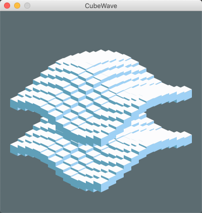
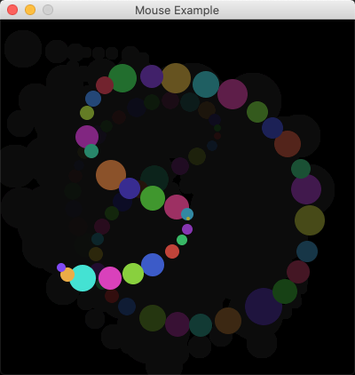

# Minvio
Minvio is a small Java library that offers very simple window, graphics and input support.  It's useful when you want to rapidly prototype an idea or add some simple graphics to a program without having to involve heavy weight libraries.

http://www.coolbubble.com/minvio

Add maven dependency:

    <dependency>
        <groupId>io.github.nickd3000</groupId>
        <artifactId>minvio</artifactId>
        <version>1.0</version>
    </dependency>




http://cc.coolbubble.com:8099

**Minimal example**

```java
package com.physmo.minvio.examples;

import com.physmo.minvio.BasicDisplay;
import com.physmo.minvio.BasicDisplayAwt;

import java.awt.*;

public class SimpleExample {

    public static void main(String ... args) {
        BasicDisplay bd = new BasicDisplayAwt(200,200);

        bd.setTitle("Simple Example");


        while (true)
        {
            bd.cls(Color.lightGray);
            bd.setDrawColor(Color.WHITE);
            bd.drawFilledRect(100-25,100-25,50, 50);
            bd.setDrawColor(Color.BLUE);
            bd.drawCircle(100,100,70);

            bd.drawText("X:"+bd.getMouseX()+" Y:"+bd.getMouseY(),10,190);
            bd.repaint(30);
        }
    }

}
```
