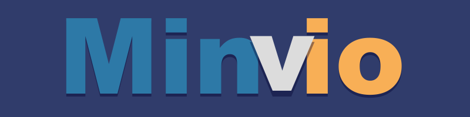
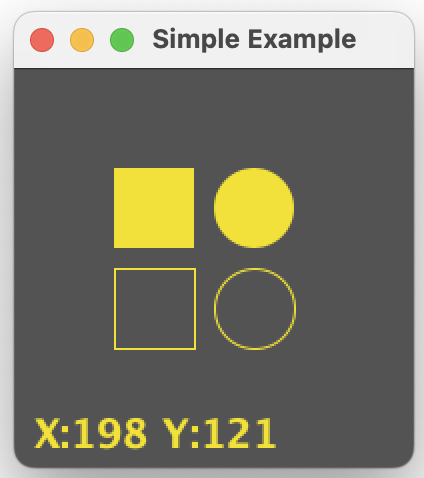
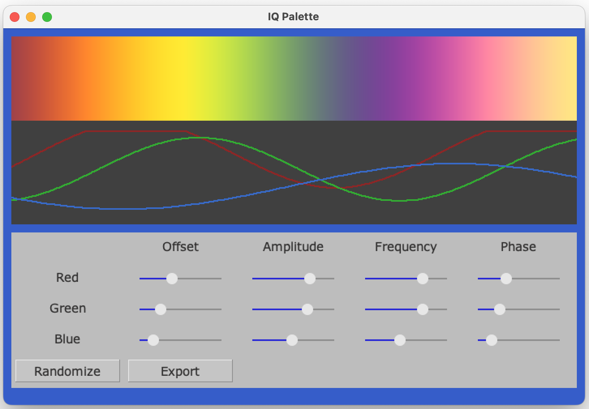

## Interactive 2D graphics in plain Java

Minvio makes interactive 2D graphics simple in plain Java. It removes the
repetitive Java2D setup while preserving a small API, no runtime dependencies,
and direct access to standard types such as `BufferedImage`, `Color`, and
`Font`.

Minvio creates the application window and runs the timed update and draw loop,
leaving you to focus on your graphics and experiments.

It is designed for:

- Generative and programmatic art
- Algorithm visualization and development
- Experiments and proofs of concept
- Teaching and learning
- Small interactive desktop tools and toys

Minvio is deliberately a lightweight 2D sketch library, not a game engine. For
projects that require 3D rendering, GPU shaders, physics, audio, or mobile and
web deployment, a larger framework such as Processing, OPENRNDR, libGDX, or
FXGL may be a better fit.

Additional examples are available here: https://github.com/nickd3000/minvio-examples

**Website with FAQ and Blog posts on the project: https://nickd3000.github.io/minvio/**

## Installation

Add the Maven dependency:

``` xml
<dependency>
    <groupId>io.github.nickd3000</groupId>
    <artifactId>minvio</artifactId>
    <version>1.22</version>
</dependency>
```

## Minimal Example

``` java
import com.physmo.minvio.MinvioApp;
import com.physmo.minvio.utils.Palette;

class SimpleExample extends MinvioApp {

    public static void main(String... args) {
        MinvioApp app = new SimpleExample();
        app.start(200, 200, "Simple Example", 60);
    }

    @Override
    public void draw(double delta) {
        cls(Palette.SLATE);
        setDrawColor(Palette.AMBER);
        
        drawFilledRect(50, 50, 40, 40);
        drawFilledCircle(120, 70, 20);
        drawCircle(120, 120, 20);
        drawRect(50, 100, 40, 40);

        drawText("X:" + getMouseX() + " Y:" + getMouseY(), 10, 190);

    }
}
```



## 2D Drawing API

Minvio includes common outline and filled primitives for circles, ellipses,
rectangles, triangles, polygons, polylines, and Java2D `Shape` objects. Arcs use
radians, matching the transform API.

Drawing state includes color, font, stroke width, alpha, composite, and
rectangular clipping. Use `pushStyle()` and `popStyle()` to make temporary style
changes without manually restoring each value:

```java
void drawStyledShape() {
    pushStyle();
    setDrawColor(new Color(70, 170, 255));
    setStrokeWidth(4);
    setAlpha(0.65);
    setClip(20, 20, 160, 100);
    drawFilledEllipse(0, 0, 220, 140);
    popStyle();
}
```

Transforms use their own independent `pushMatrix()` and `popMatrix()` stack.

## Examples

Most examples use the high-level `MinvioApp` style: extend `MinvioApp`, override
`init`, `update`, and/or `draw`, then call `start(...)`. This is the recommended
way to write Minvio sketches and small applications.

Examples in this repository live under `src/main/java/com/physmo/reference/` and
are organized by topic:

- `beginner`: Java language basics taught with simple visual examples.
- `basics`: core Minvio app, image, text, resize, timing, and screenshot examples.
- `input`: keyboard, mouse, and interaction examples.
- `drawing`: drawing API, style, shape, helper, and pixel-sampling examples.
- `concepts`: common creative-coding ideas such as particles, forces, collision,
  color interpolation, transforms, and noise.
- `lowlevel`: a small set of direct `BasicDisplay` examples for advanced/manual
  display-loop control.
- `gallery`, `gui`, `ecs`, `experiments`, `wiki`, and `rigs`: larger sketches,
  GUI/ECS demos, exploratory tools, and docs-linked examples.

See `src/main/java/com/physmo/reference/README.md` for a fuller guide to the
example packages.

The separate examples repository is here:
https://github.com/nickd3000/minvio-examples

## Development

Minvio targets Java 17. When running Maven locally, use JDK 17 to avoid JaCoCo
trying to instrument newer JDK runtime classes:

```sh
JAVA_HOME=$(/usr/libexec/java_home -v 17) PATH="$JAVA_HOME/bin:$PATH" mvn test
```

## More Example Images



### Changelist

###### Version PENDING

* Added Screenshot Functionality
    * Implemented automatic screenshot saving using the F12 key in MinvioApp.
    * Added takeScreenshot() and saveScreenshot() methods with automatic file naming (e.g., AppName_1.png).
* Enhanced Drawing Precision
    * Added overloaded drawing methods across MinvioApp and DrawingContext that accept double coordinates (e.g.,
      drawPoint, drawRect, drawText, drawImage) for more sub-pixel precision.
* Added Transformation and State Management (pushMatrix, popMatrix, translate, rotate, scale)
* Added ellipses, triangles, polygon outlines, polylines, arcs, and Java2D Shape drawing.
* Added stroke width, alpha/composite, clipping, and pushStyle/popStyle state management.
* Added Rotations1 gallery example (concentric animated rings)
* Added TransformationExample, FractalTreeExample, and KaleidoscopeExample gallery examples
* Added Fractal Tile example

###### Version 1.20 - Aug 2025

* Added Screen resizing functionality
* Added Initial GUI layout support
* Added Palette Class with predefined colours
* Updated to Java 17
* Added Array class for an efficient List style container that avoids reallocation.

###### Version 1.10 - September 2024

* Gui: Added Label, Slider and text button.
* Gui: Added more color components to GuiContext.
* Cleanup: Moved structure objects to types package.

###### Version 1.08 - August 2024

* Simplified app startup
* Added pass-through methods in MinvioApp to drawing context

###### Version 1.07 - May 2023

* Removed all examples - They are now in a separate project - minvio-examples

###### Version 1.06 - December 23 2021

* Matrix drawer changes
* Added QuickRandom

###### Version 1.05 - December 13 2021

* **Added Entity-Component system**
* Added Entity-Component example
* Added Vec3 object
* Added bucket list utility and gravity particle example
* Added Ribbons to gallery projects
* Added getMousePointNormalised

###### Version 1.04 - October 17 2021

* Added Perlin Noise utility and examples.
* Added colour gradient system and examples.
* Added Matrix and point list rendering helpers with examples.

###### Version 1.03 - October 10 2021

* Added anchor system.
* Rearranged example file folders.
* Added lerp functions for several types.
* Added FindClosestPointInList helper function.
* Changes to image loading.

http://www.coolbubble.com/cc/ - coolcompare
