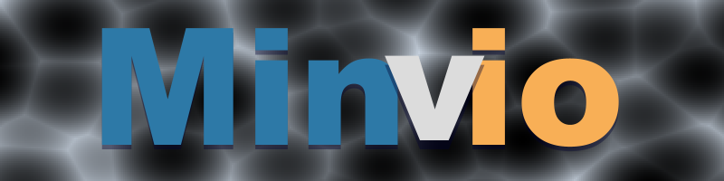

[](https://maven-badges.herokuapp.com/maven-central/io.github.nickd3000/minvio)


Minvio is a Lightweight Java framework for developing graphical applications.

Minvio handles creating the application window and timed draw loop, and exposes a host of drawing and input
functionality.

http://www.coolbubble.com/projects/minvio

Add maven dependency:

``` xml
<dependency>
    <groupId>io.github.nickd3000</groupId>
    <artifactId>minvio</artifactId>
    <version>1.07</version>
</dependency>
```

**Minimal example**

``` java
import com.physmo.minvio.BasicDisplay;
import com.physmo.minvio.BasicDisplayAwt;
import com.physmo.minvio.MinvioApp;

import java.awt.Color;

class SimpleExample extends MinvioApp {

    public static void main(String... args) {
        MinvioApp app = new SimpleExample();
        // Start the app running with a window size of 200x200 pixels, at 60 frames per second.
        app.start(new BasicDisplayAwt(200, 200), "Simple Example", 60);
    }

    @Override
    public void draw(BasicDisplay bd, double delta) {
        bd.cls(Color.LIGHT_GRAY);
        bd.setDrawColor(Color.WHITE);
        bd.drawFilledRect(75, 75, 50, 50);
        bd.setDrawColor(Color.BLUE);
        bd.drawCircle(100, 100, 70);
        bd.drawText("X:" + bd.getMouseX() + " Y:" + bd.getMouseY(), 10, 190);
    }
}
```

### Changelist

###### Version 1.07 - May 2023

* Removed all example - They are now in a separate project - minvio-examples

###### Version 1.06 - December 23 2021

* Matrix drawer changes
* Added QuickRandom

###### Version 1.05 - December 13 2021

* **Added Entity-Component system**
* Added Entity-Component example
* Added Vec3 object
* Added bucket list utility and gravity particle example
* Added Ribbons to gallery
* Added getMousePointNormalised

###### Version 1.04 - October 17 2021

* Added Perlin Noise utility and examples.
* Added colour gradient system and examples.
* Added Matrix and point list rendering helpers with examples.

###### Version 1.03 - October 10 2021

* Added anchor system.
* Rearranged example file folders.
* Added lerp functions for several types.
* Added FindClosestPointInList helper function.
* Changes to image loading.

http://www.coolbubble.com/cc/ - coolcompare