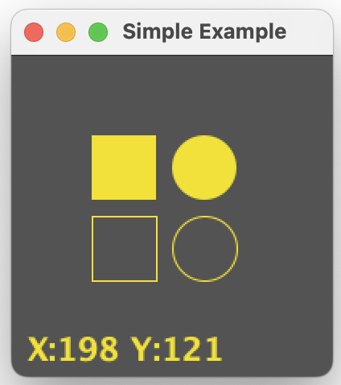

# MinVio

Lightweight Java framework for fast, minimal graphical apps and experiments.

- Simple API for drawing and input
- Built‑in window and timed draw loop
- Great for programmatic art, prototypes, and teaching


---

## Quick Start

Add the Maven dependency:

```xml

<dependency>
    <groupId>io.github.nickd3000</groupId>
    <artifactId>minvio</artifactId>
    <version>1.21</version>
</dependency>
```

Minimal example:

```java
import com.physmo.minvio.MinvioApp;

import java.awt.Color;

class SimpleExample extends MinvioApp {
    public static void main(String... args) {
        MinvioApp app = new SimpleExample();
        app.start(200, 200, "Simple Example", 60);
    }

    @Override
    public void draw(double delta) {
        cls(new Color(207, 198, 179));
        setDrawColor(new Color(17, 52, 69, 215));
        drawFilledRect(50, 50, 40, 40);
        drawFilledCircle(120, 70, 20);
        drawCircle(120, 120, 20);
        drawRect(50, 100, 40, 40);
        drawText("X:" + getMouseX() + " Y:" + getMouseY(), 10, 190);
    }
}
```



- Repository: https://github.com/nickd3000/minvio
- Examples: https://github.com/nickd3000/minvio-examples

---

## Blog

- Introduction to MinVio: Getting Started with Lightweight Java Graphics — [Read the first post →](pages/blog001.md)

More posts coming soon.

---

## FAQ

- Frequently Asked Questions — [Read the FAQ →](pages/faq.md)

---

## What is MinVio?

MinVio handles boilerplate like window creation and frame timing so you can focus on drawing:

- Draw points, lines, rectangles, circles, text, and images
- Clean subclass model: override `draw(delta)`
- Utility classes and helpers for common visual tasks

If you build interactive sketches, algorithm visualizations, or teaching demos, MinVio keeps things small and fast.
